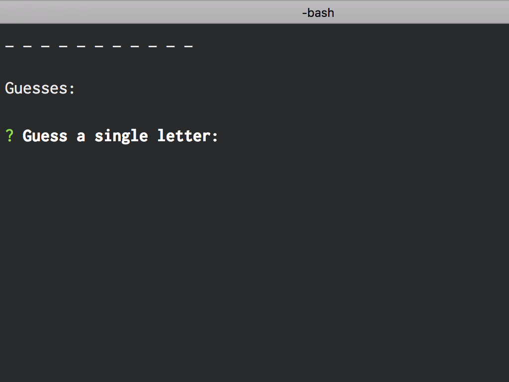
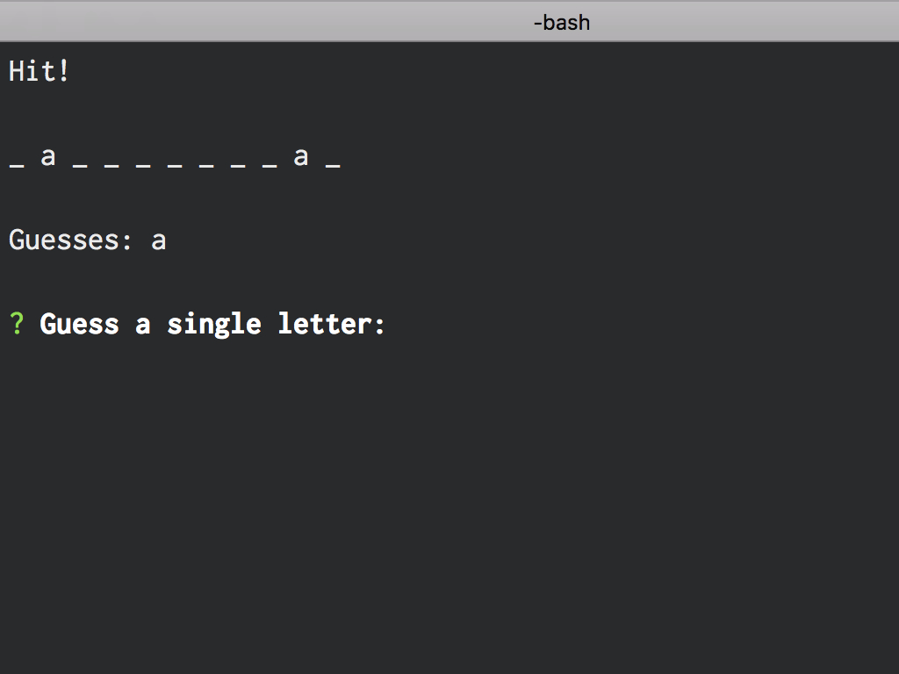
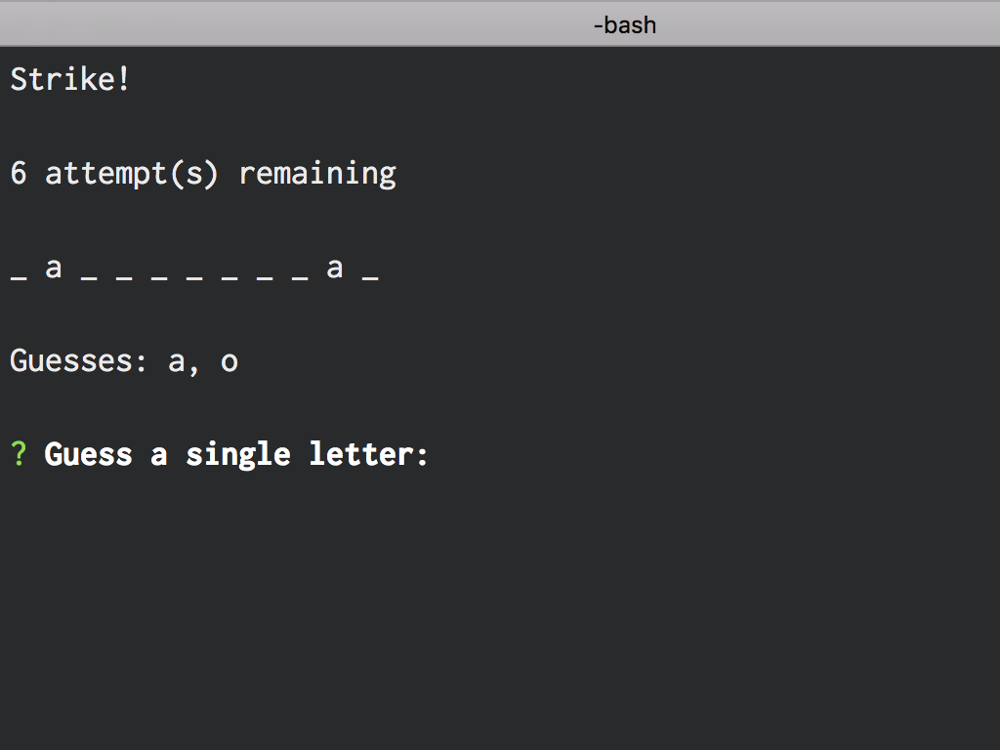
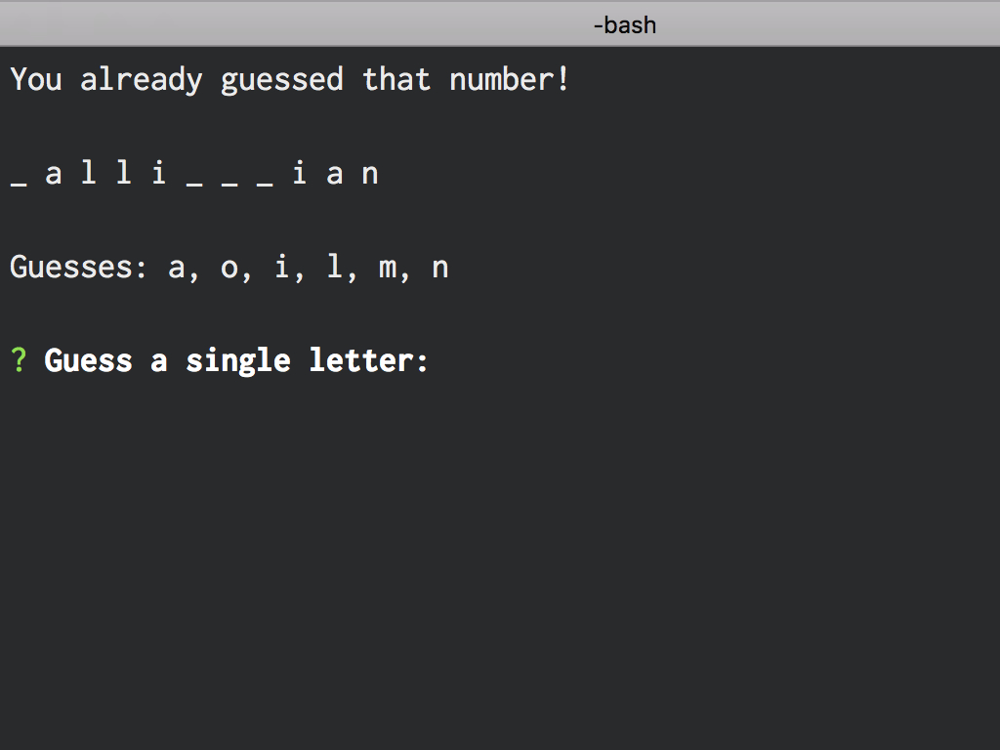
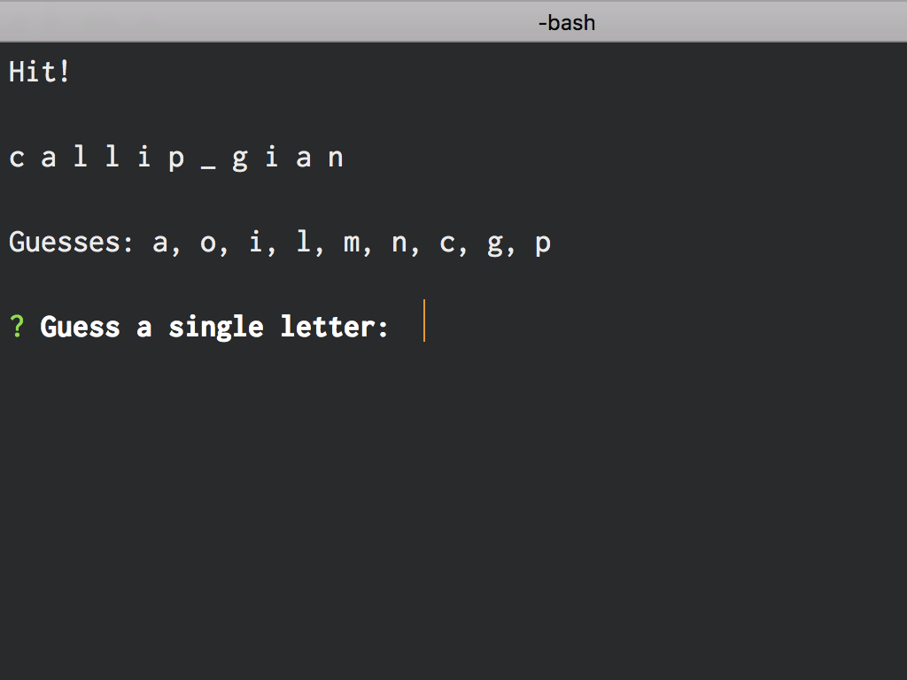
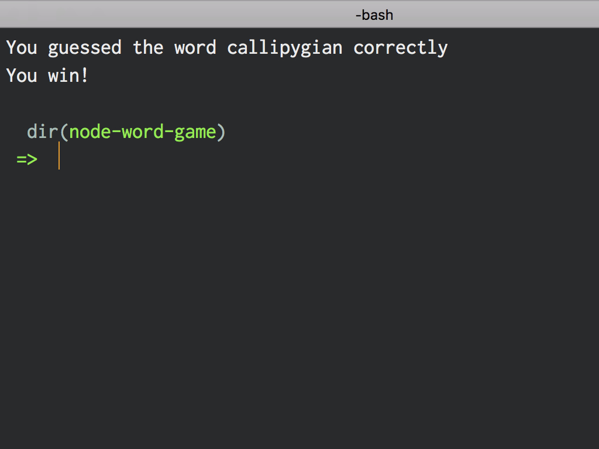

# Node Word Guess Game

Node Word Guess Game is a command line game where a player tries to guess a word one letter at a time.

## Use

Start by running:

```bash
node index.js
```

### Screen Shots

#### Game Start



#### Hit Output



#### Miss Output



#### Already Guessed Output



#### Mid-Game Progress



#### End Game


